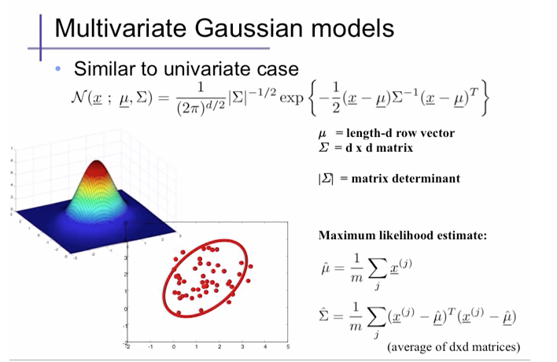
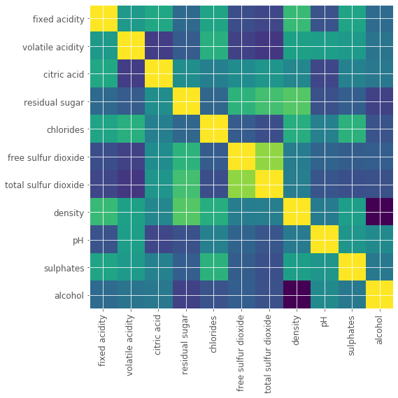
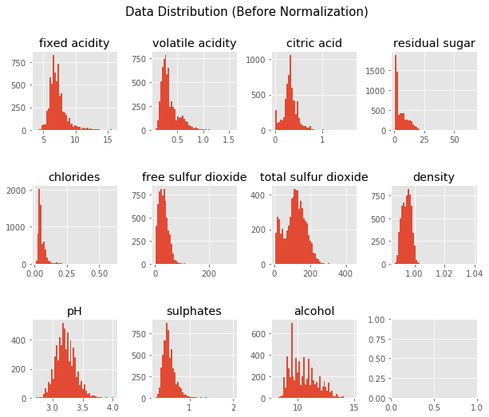
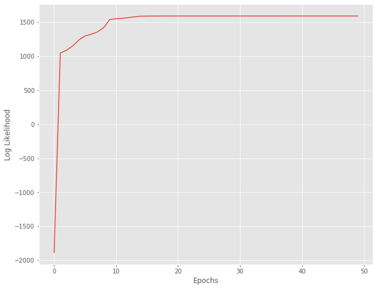
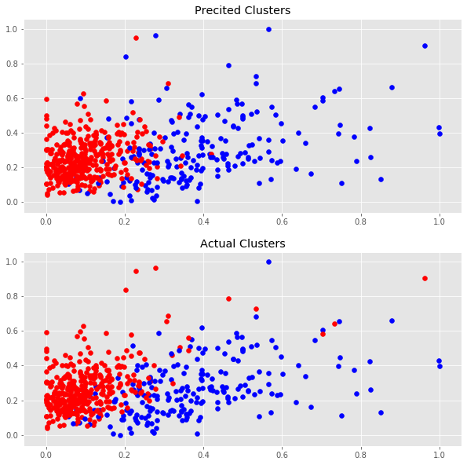

## EECS738 Project 1
### Submitted by  : Nitish Gupta
### Date          : 03/01/2021

## Gussian Mixture Model
This project implements Gussian Mixture Model and it's expectaition maximization algorithm. We further dive deeper into three different [UCI ML dataset](https://archive.ics.uci.edu/ml/datasets.php)    
  
[src: https://medium.com/@SeoJaeDuk/archived-post-multivariate-gaussian-distributions-and-entropy-3-991578ca534c]  

  

  

  

  
